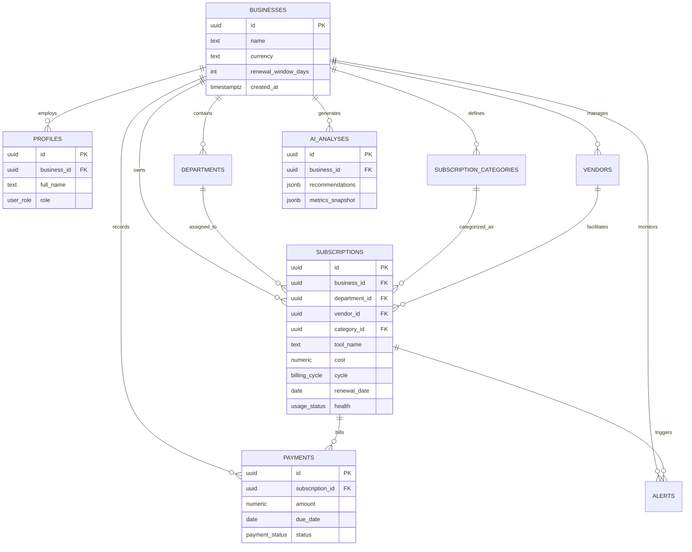

# SpendGuard: Technical Data Architecture Documentation

## 1. Executive Summary
SpendGuard is a premium SaaS spend management platform designed to provide organizations with extreme visibility into their recurring expenses. The architecture centers around a **secure, multi-tenant Postgres-first design** on Supabase, leveraging Row Level Security (RLS) and AI-driven analysis to proactively identify waste and consolidation opportunities.

---

## 2. Entity Relationship Diagram (ERD)



---

## 3. Entity Definitions & Integrity

### **Core Entities**
1.  **Businesses**: The root tenant object. All platform data is partitioned by `business_id`.
2.  **Profiles**: Extends Supabase `auth.users`, linking authenticated users to their specific Business tenant via a Foreign Key.
3.  **Subscriptions**: The primary ledger of organization-wide tools. Tracks cost, renewal cadence, and the innovative **Usage Status** (e.g., *Duplicate Candidate*).

### **Relational Metadata**
-   **Departments**: Allows financial and operational slicing of spend.
-   **Vendors**: Maintains tool-identity mapping for brand-consistent logo rendering.
-   **Categories**: Groups tools (e.g., *Productivity*, *Security*) for high-level consumption analysis.

### **Operational Ledger**
-   **Payments**: The granular transaction history. Links to Subscriptions to track drift between "Contracted Cost" and "Actual Spend."
-   **Alerts**: Event-driven notifications (e.g., *Overdue Payment*, *Approaching Renewal*) specifically scoped to the current tenant.

---

## 4. Innovative Schema Overview
The uniqueness of SpendGuard lies in its **Secure Contextual Layer**:

### **Multi-Tenancy via RLS**
Instead of handling tenant isolation in application code, SpendGuard uses Postgres **Row Level Security**. Every table has a policy that executes a `security definer` function to ensure users can *only* see data belonging to their own `business_id`.

### **AI Integration Layer (`ai_analyses`)**
Unlike static reporting tools, SpendGuard stores JSONB snapshots of AI recommendations. This allows the system to compare past financial states with current ones to track "Savings Efficiency" over time.

---

## 5. Sample Innovative SQL Queries

### **A. Detecting Potential $0 Usage Waste**
Identify subscriptions flagged as 'unused' and calculate the immediate monthly burn rate that could be reclaimed.
```sql
SELECT 
  d.name as department, 
  s.tool_name, 
  s.cost, 
  s.currency 
FROM public.subscriptions s
JOIN public.departments d ON s.department_id = d.id
WHERE s.usage_status = 'unused' 
  AND s.status = 'active'
ORDER BY s.cost DESC;
```

### **B. Calculating Tenant Spend Pipeline**
Aggregates future projections for the next 90 days to help Finance teams anticipate credit card load.
```sql
SELECT 
  date_trunc('month', due_date) as payment_month,
  sum(amount) as estimated_outflow
FROM public.payments
WHERE status = 'projected' 
  AND due_date BETWEEN now() AND now() + interval '90 days'
GROUP BY 1 ORDER BY 1;
```

### **C. Cross-Department Duplicate Identification**
A query used by the AI engine to detect if multiple departments are paying for the same vendor independently.
```sql
SELECT 
  v.name as vendor, 
  COUNT(DISTINCT s.department_id) as dept_count,
  STRING_AGG(d.name, ', ') as department_list
FROM public.subscriptions s
JOIN public.vendors v ON s.vendor_id = v.id
JOIN public.departments d ON s.department_id = d.id
GROUP BY v.name
HAVING COUNT(DISTINCT s.department_id) > 1;
```
