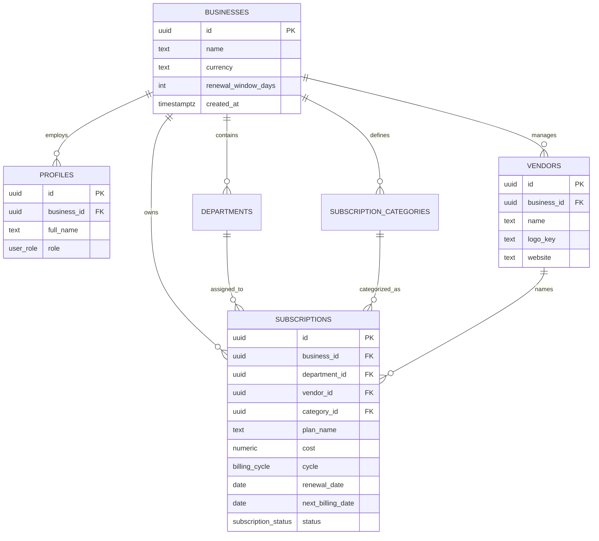

# SpendGuard: Technical Data Architecture Documentation

## 1. Executive Summary

SpendGuard is a SaaS subscription management platform built on a secure, multi-tenant Supabase/Postgres model. The current data model focuses on vendor-backed subscription records, departments, categories, renewal dates, and spend reporting.

---

## 2. Entity Relationship Diagram



---

## 3. Entity Definitions

1. **Businesses**: Root tenant record. All workspace data is partitioned by `business_id`.
2. **Profiles**: Links Supabase `auth.users` records to a tenant.
3. **Vendors**: Canonical subscription names and logo metadata. A subscription must have a vendor.
4. **Subscriptions**: Contract and renewal ledger for vendor plans. The main display name comes from `vendors.name`.
5. **Departments and Categories**: Reporting dimensions for spend allocation.

Payments, alerts, and saved AI analysis records have been removed from the schema.

---

## 4. Security Model

SpendGuard uses Postgres Row Level Security. Each tenant-scoped table checks `public.current_business_id()`, which resolves the signed-in user's `business_id` from `profiles`.

The service role is only used server-side for account bootstrap.

---

## 5. Useful SQL Queries

### Monthly Spend by Department

```sql
SELECT
  d.name AS department,
  SUM(
    CASE s.billing_cycle
      WHEN 'annual' THEN s.cost / 12
      WHEN 'quarterly' THEN s.cost / 3
      ELSE s.cost
    END
  ) AS monthly_spend
FROM public.subscriptions s
LEFT JOIN public.departments d ON s.department_id = d.id
WHERE s.status = 'active'
GROUP BY d.name
ORDER BY monthly_spend DESC;
```

### Upcoming Renewals

```sql
SELECT
  v.name AS vendor,
  s.plan_name,
  s.renewal_date,
  s.cost,
  s.billing_cycle
FROM public.subscriptions s
JOIN public.vendors v ON s.vendor_id = v.id
WHERE s.status = 'active'
ORDER BY s.renewal_date ASC;
```

### Cross-Department Duplicate Vendors

```sql
SELECT
  v.name AS vendor,
  COUNT(DISTINCT s.department_id) AS department_count,
  STRING_AGG(DISTINCT d.name, ', ') AS departments
FROM public.subscriptions s
JOIN public.vendors v ON s.vendor_id = v.id
LEFT JOIN public.departments d ON s.department_id = d.id
WHERE s.status = 'active'
GROUP BY v.name
HAVING COUNT(DISTINCT s.department_id) > 1;
```
